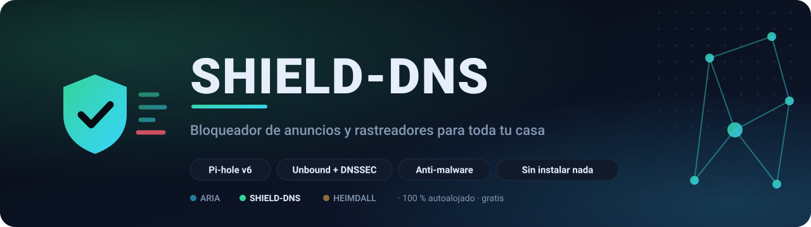
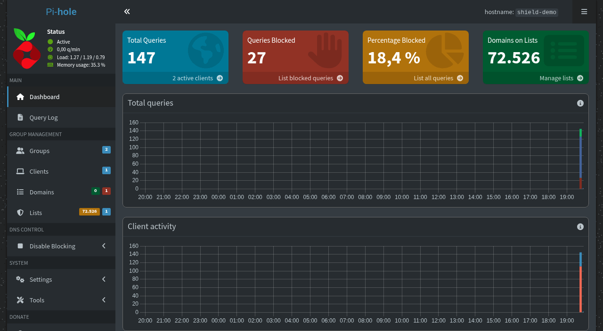
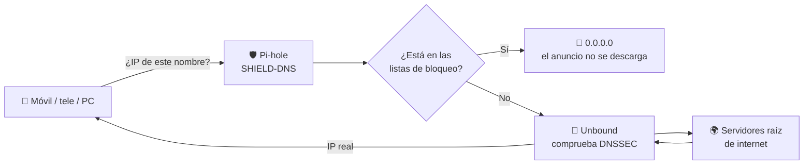
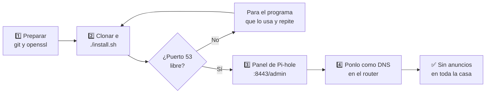
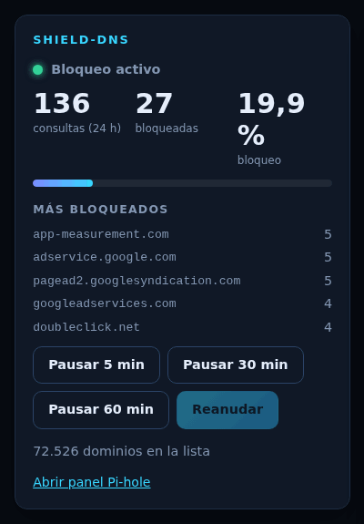
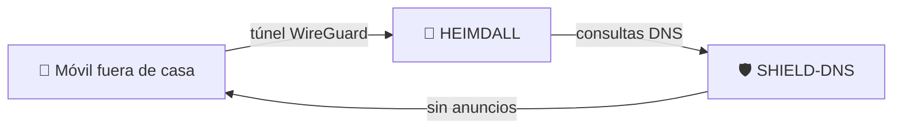

<a name="readme-top"></a>

<p align="center">
  <sub>Parte del ecosistema ARIA&nbsp;&nbsp;·&nbsp;&nbsp;<a href="https://github.com/BertMarti/ARIA">🤖 ARIA</a>&nbsp;&nbsp;·&nbsp;&nbsp;<b>🛡️ SHIELD-DNS</b>&nbsp;&nbsp;·&nbsp;&nbsp;<a href="https://github.com/BertMarti/HEIMDALL">🔐 HEIMDALL</a></sub>
</p>

<p align="center">
  <picture>
    <source media="(prefers-color-scheme: dark)" srcset="docs/img/banner-oscuro.svg">
    <source media="(prefers-color-scheme: light)" srcset="docs/img/banner-claro.svg">
    
  </picture>
</p>

<p align="center">
  <a href="LICENSE"></a>
  
  
  
  
  
  
  
  
</p>

<p align="center">
  <b><a href="#-instalación">🚀 Instalar</a></b>&nbsp;&nbsp;·&nbsp;&nbsp;
  <a href="#-ponlo-como-dns-de-tu-red">📡 Ponlo como DNS</a>&nbsp;&nbsp;·&nbsp;&nbsp;
  <a href="#-uso-diario">🧭 Uso diario</a>&nbsp;&nbsp;·&nbsp;&nbsp;
  <a href="#-problemas-frecuentes">🆘 Problemas</a>
</p>

**Bloqueador de anuncios, rastreadores y webs maliciosas para toda tu casa.** Se instala en una Raspberry Pi o en un PC con Linux y protege a todos los dispositivos de tu red (móviles, tablets, teles, consolas…) sin instalar nada en ellos.

Por dentro usa [Pi-hole v6](https://pi-hole.net) para bloquear y [Unbound](https://nlnetlabs.nl/projects/unbound/) para resolver los nombres por su cuenta, con DNSSEC y sin depender de Google ni de tu operador.

Funciona solo o como aplicación integrada en [ARIA](https://github.com/BertMarti/ARIA), el asistente de IA que gestiona tus aplicaciones de casa.

<p align="center">
  
  <br><sub>Panel de Pi-hole en una instancia de demostración con datos de prueba.</sub>
</p>

> [!NOTE]
> En los ejemplos, `192.168.1.50` es la máquina donde instalas SHIELD-DNS y `192.168.1.1` tu router. Cámbialas por las tuyas.

## 📑 Índice

- [🔍 Cómo funciona](#-cómo-funciona)
- [✨ Qué incluye](#-qué-incluye)
- [📋 Requisitos](#-requisitos)
- [🚀 Instalación](#-instalación)
- [⚙️ Configuración](#️-configuración)
- [📡 Ponlo como DNS de tu red](#-ponlo-como-dns-de-tu-red)
- [🧭 Uso diario](#-uso-diario)
- [🤖 Con ARIA](#-con-aria)
- [🔐 Con HEIMDALL (VPN)](#-con-heimdall-vpn)
- [💾 Copias, restauración y actualización](#-copias-restauración-y-actualización)
- [🗑️ Desinstalar](#️-desinstalar)
- [🆘 Problemas frecuentes](#-problemas-frecuentes)
- [🔌 Puertos y contenedores](#-puertos-y-contenedores)
- [🌐 El ecosistema ARIA](#-el-ecosistema-aria)
- [📄 Licencia](#-licencia)

## 🔍 Cómo funciona

Cada vez que un dispositivo abre una web o una app, primero pregunta al **DNS** «¿qué dirección tiene este nombre?». Si tu red usa SHIELD-DNS como DNS:

1. **Pi-hole** mira si el nombre está en sus listas de bloqueo. Si es un anuncio, un rastreador o una web peligrosa, responde `0.0.0.0` y el anuncio no se descarga.
2. Si no está bloqueado, se lo pasa a **Unbound**, que lo resuelve directamente con los servidores raíz de internet y comprueba la firma DNSSEC.



<details>
<summary>Si tu visor no muestra el diagrama, aquí está en texto</summary>

```
 Móvil / tele / PC ──► SHIELD-DNS (Pi-hole) ──► ¿bloqueado? ── sí ──► 0.0.0.0
                                                     │
                                                     └─ no ──► Unbound ──► servidores raíz de internet
```

</details>

## ✨ Qué incluye

| | Pieza | Qué hace |
|:---:|---|---|
| 🛡️ | **Pi-hole v6** | Bloqueo por DNS, con panel web en HTTPS (`:8443`) y HTTP (`:8080`) |
| 🔐 | **Unbound** | Resolvedor propio, con DNSSEC |
| 📜 | **Listas de bloqueo** ya cargadas | La de Pi-hole y dos de [HaGeZi](https://github.com/hagezi/dns-blocklists): *Multi* (anuncios y rastreadores) y *TIF mini* (malware, phishing y estafas) |
| 🏷️ | **Nombre local `aria.lan`** | Apunta a tu máquina para entrar en ARIA con `https://aria.lan` desde casa o desde la VPN |
| ⚡ | **Un comando para todo** | Instalación, actualización, copia y restauración |

<p align="right"><a href="#readme-top">⬆️ Volver arriba</a></p>

## 📋 Requisitos

| | Necesitas |
|---|---|
| 🖥️ Máquina | Raspberry Pi 4/5 con Raspberry Pi OS de 64 bits, o un PC/mini-PC con Debian, Ubuntu u otra distribución Linux. Pi-hole y Unbound gastan muy poca memoria. |
| 🐳 Software | Docker con `docker compose` v2. Si falta, el instalador lo instala con el script oficial. |
| 🔌 Puerto | El **puerto 53** (TCP y UDP) libre en la máquina. |
| 📍 IP fija | Una **IP fija** para la máquina (resérvala en el DHCP del router). Si cambia, tu red se queda sin DNS. |

> [!WARNING]
> **Windows**: no recomendado. En WSL2/Docker Desktop el puerto 53 y el acceso desde el resto de la red suelen dar problemas. Usa una máquina con Linux.

## 🚀 Instalación



**1. Prepara la máquina** (si no tienes Docker, el instalador lo pone):

```bash
sudo apt update && sudo apt install -y git openssl
```

**2. Clona e instala**:

```bash
mkdir -p ~/homelab && cd ~/homelab
git clone https://github.com/BertMarti/SHIELD-DNS.git
cd SHIELD-DNS
./install.sh
```

> ✅ **Comprobación:** al terminar verás la dirección del panel y la IP que debes usar como DNS. `docker compose ps` muestra `shield-pihole` y `shield-unbound` en marcha.

**3. Entra en el panel** (ver [primer acceso](#primer-acceso-al-panel)).

**4. Ponlo como DNS de tu red** (ver [más abajo](#-ponlo-como-dns-de-tu-red)): instalarlo no basta.

> [!TIP]
> ¿Quieres también ARIA y la VPN? Instala las tres aplicaciones de una vez con el [instalador de ARIA](https://github.com/BertMarti/ARIA#-inicio-rápido-5-minutos):
>
> ```bash
> curl -fsSL https://raw.githubusercontent.com/BertMarti/ARIA/main/instalar-todo.sh | bash
> ```

<details>
<summary><b>🔧 Qué hace <code>install.sh</code></b> (puedes repetirlo cuando quieras: no borra nada)</summary>
<br>

1. Instala Docker si no lo tienes.
2. Comprueba que el puerto 53 está libre. Si otro programa lo usa (por ejemplo `systemd-resolved`, `dnsmasq` o un Pi-hole instalado sin Docker), **se detiene** y te dice cuál es: páralo tú y repite.
3. Crea `.env` con una contraseña aleatoria para el panel y el nombre `aria.lan`.
4. Arranca Unbound y Pi-hole y espera a que estén listos.
5. Añade las listas de `EXTRA_ADLISTS` y las descarga (tarda un par de minutos).
6. Comprueba que el DNS responde.

</details>

### Primer acceso al panel

1. Abre `https://192.168.1.50:8443/admin`.
2. El navegador avisará del certificado: es propio de Pi-hole. Pulsa **Avanzado → Continuar**.
3. Pi-hole no tiene usuario, solo **contraseña**. Está en el archivo `.env`:
   ```bash
   grep PIHOLE_PASSWORD ~/homelab/SHIELD-DNS/.env
   ```

> ✅ **Comprobación:** ves el *Dashboard* de Pi-hole con el contador de dominios en las listas.

<p align="right"><a href="#readme-top">⬆️ Volver arriba</a></p>

## ⚙️ Configuración

Todo está en `.env` (se crea a partir de [`.env.example`](.env.example)). Tras cambiarlo, aplica con `./install.sh`.

| Variable | Por defecto | Para qué |
|---|---|---|
| `TZ` | `Europe/Madrid` | Zona horaria |
| `PIHOLE_PASSWORD` | aleatoria (la genera `install.sh`) | Contraseña del panel |
| `WEB_HTTP_PORT` | `8080` | Puerto del panel por HTTP |
| `WEB_HTTPS_PORT` | `8443` | Puerto del panel por HTTPS |
| `LOCAL_DNS_HOSTS` | `"<IP de la máquina> aria.lan"` | Nombres locales, formato `"IP nombre;IP nombre"` |
| `EXTRA_ADLISTS` | HaGeZi Multi y TIF mini | Listas extra, separadas por espacios |

Ejemplo para dar nombre a otro aparato de casa:

```bash
LOCAL_DNS_HOSTS="192.168.1.50 aria.lan;192.168.1.60 nas.lan"
```

Puedes añadir más listas, dominios permitidos o bloqueados y grupos desde el propio panel de Pi-hole.

## 📡 Ponlo como DNS de tu red

Instalarlo no basta: tus dispositivos tienen que preguntarle a él.

### Opción 1: en el router (recomendada)

Así todos los dispositivos lo usan solos. Cada router es distinto, pero los pasos son parecidos:

1. Entra en el router desde el navegador: normalmente `http://192.168.1.1` (mira la pegatina del router).
2. Busca la configuración **LAN**, **DHCP** o **DNS**.
3. En **DNS primario** pon la IP de tu máquina: `192.168.1.50`.
4. En **DNS secundario**, déjalo vacío o repite `192.168.1.50`. Si pones uno externo (por ejemplo `1.1.1.1`), algunos dispositivos lo usarán y se saltarán el bloqueo.
5. Guarda. Los dispositivos lo usarán cuando renueven su conexión (desconecta y conecta el Wi-Fi para acelerarlo).

> [!CAUTION]
> Si tu router **no deja cambiar el DNS**, puedes desactivar su DHCP y activar el de Pi-hole (*Settings → DHCP* en el panel). Hazlo con calma: si algo falla, los dispositivos se quedan sin red hasta que lo arregles.

### Opción 2: en cada dispositivo

| Dispositivo | Dónde |
|---|---|
| 🤖 **Android** | *Ajustes → Wi-Fi → (tu red) → Ajustes de IP: Estática → DNS 1*. Desactiva también el «DNS privado» (en *Ajustes → Red*), o se saltará SHIELD-DNS. |
| 🍏 **iPhone/iPad** | *Ajustes → Wi-Fi → (i) → Configurar DNS → Manual*. |
| 💻 **Windows / Mac / Linux** | En los ajustes de la red, DNS manual `192.168.1.50`. |

### IPv6

> [!IMPORTANT]
> Algunos routers reparten también un DNS IPv6 (el de tu operador). Los dispositivos que lo usen se saltarán SHIELD-DNS. Si ves que los anuncios no se bloquean, desactiva IPv6 en la LAN del router o el DNS IPv6 que entrega.

### Comprueba que funciona

Desde cualquier ordenador de casa:

```bash
nslookup doubleclick.net 192.168.1.50     # debe responder 0.0.0.0
nslookup example.com 192.168.1.50         # debe responder una IP normal
```

> ✅ **Comprobación:** el primero responde `0.0.0.0`, el segundo una IP normal, y en el panel de Pi-hole verás subir las consultas.

<p align="right"><a href="#readme-top">⬆️ Volver arriba</a></p>

## 🧭 Uso diario

| Quiero… | Cómo |
|---|---|
| 👀 Ver qué se bloquea | Panel → *Dashboard* y *Query Log* |
| ⏸️ Pausar el bloqueo un rato | Panel → *Disable blocking* (o desde ARIA) |
| ✅ Permitir un dominio que se rompió | Panel → *Domains*, o `docker exec shield-pihole pihole allow ejemplo.com` |
| ⛔ Bloquear un dominio | Panel → *Domains*, o `docker exec shield-pihole pihole deny ejemplo.com` |
| 🔄 Actualizar las listas ya | `docker exec shield-pihole pihole -g` |
| 🔑 Cambiar la contraseña | Cambia `PIHOLE_PASSWORD` en `.env` y ejecuta `docker compose up -d` (si usas ARIA, cámbiala también en su `SHIELD_PASSWORD`) |
| 📜 Ver los registros | `docker compose logs -f pihole` |

> [!TIP]
> Si una web o app deja de funcionar, mira en *Query Log* qué dominio se bloqueó justo entonces y permítelo.

## 🤖 Con ARIA

[ARIA](https://github.com/BertMarti/ARIA) trae SHIELD-DNS como **aplicación integrada**. Si los dos están en la misma carpeta (`~/homelab/SHIELD-DNS` y `~/homelab/ARIA`), el instalador de ARIA lee la contraseña de Pi-hole y se conecta solo. Si no, pon en el `.env` de ARIA:

```bash
SHIELD_URL=http://192.168.1.50:8080
SHIELD_PASSWORD=la-contraseña-de-pihole
```

y aplica con `docker compose up -d` en la carpeta de ARIA.

<table>
  <tr>
    <td width="62%" valign="top">

Con ARIA tienes:

- 🏠 Un **mosaico en Inicio** con su estado y «Copiar contraseña».
- 🎛️ La tarjeta **SHIELD-DNS** en el Centro de control: consultas, bloqueos y **Pausar 5/30/60 min** / **Reanudar**.
- 💬 **Chat**: «¿cuántos anuncios has bloqueado hoy?», «pausa el bloqueador 10 minutos». En Telegram, `/bloqueo`.
- 📡 **Inventario de red**: ARIA usa la tabla de dispositivos de Pi-hole.
- 👨‍👧 **Control parental** por dispositivo (pausar internet, bloquear TikTok, YouTube…, horarios). ARIA crea en Pi-hole sus propios grupos (`ARIA-pausa`, `ARIA-svc-…`) y solo toca lo que ella crea. Es bloqueo por DNS: no frena DNS fijos, DNS cifrado ni VPN.
- 🔒 **«DNS privado» bajo control**: el servicio `dns-privado` del control parental bloquea solo los nombres de los servidores DNS cifrados conocidos (DoH/DoT), para que un móvil no se salte el filtro. No toca la publicidad ni la VPN, y se aplica por dispositivo.
- 📋 **Listas de bloqueo** desde ARIA: ver cuántos dominios hay y **actualizar las listas** (gravity) con un botón.
- 📊 **Estadísticas por dispositivo** (consultas y bloqueos de cada uno en 24 h o 7 días) y un **informe semanal** por Telegram.
- 📰 El **resumen diario** de ARIA incluye los bloqueos del día y avisa si SHIELD-DNS no responde.
- 🔔 **Avisos** si SHIELD-DNS se cae o deja de responder.
- 🏷️ `https://aria.lan` para entrar en ARIA desde casa.
- 🌍 Con un dominio en Cloudflare, el panel en `https://shield.tu-dominio.com` (ver la [guía de ARIA](https://github.com/BertMarti/ARIA/blob/main/docs/INSTALACION.md)).

</td>
    <td width="38%" valign="top"><p align="center"><sub>La tarjeta de SHIELD-DNS en ARIA (demo)</sub></p></td>
  </tr>
</table>

## 🔐 Con HEIMDALL (VPN)

Si instalas SHIELD-DNS **antes** que [HEIMDALL](https://github.com/BertMarti/HEIMDALL), la VPN lo usa como DNS automáticamente: tu móvil bloquea anuncios también fuera de casa. Si instalaste HEIMDALL primero, cambia el DNS en su panel (*Administración*) a la IP de tu máquina (`192.168.1.50`).



> [!NOTE]
> Las consultas que llegan por la VPN aparecen en Pi-hole con la IP interna de Docker, no con la del dispositivo concreto.

<p align="right"><a href="#readme-top">⬆️ Volver arriba</a></p>

## 💾 Copias, restauración y actualización

<details open>
<summary><b>💾 Copia de seguridad</b></summary>
<br>

```bash
./backup.sh
```

Crea `backups/shield-dns-AAAAMMDD-HHMM.tar.gz` con tu `.env` y una exportación de Pi-hole (listas, dominios permitidos y bloqueados, clientes, grupos y ajustes). Guarda las 7 más recientes. Contiene la contraseña del panel: **cópiala fuera de la máquina**. Si usas ARIA, su script `sistema/instalar-copias.sh` hace una copia cifrada cada día.

</details>

<details>
<summary><b>♻️ Restaurar</b></summary>
<br>

Por ejemplo, en una máquina recién formateada:

```bash
git clone https://github.com/BertMarti/SHIELD-DNS.git && cd SHIELD-DNS
mkdir -p backups && cp /ruta/a/shield-dns-AAAAMMDD-HHMM.tar.gz backups/
./restore.sh backups/shield-dns-AAAAMMDD-HHMM.tar.gz
```

Pide confirmación, recupera `.env`, instala y vuelve a cargar la configuración de Pi-hole.

</details>

<details>
<summary><b>⬆️ Actualizar</b></summary>
<br>

```bash
cd ~/homelab/SHIELD-DNS
./update.sh
```

Hace una copia, descarga el código y las imágenes nuevas y vuelve a instalar. Tus listas y ajustes se conservan.

</details>

## 🗑️ Desinstalar

```bash
./uninstall.sh            # para y quita los contenedores; conserva data/ y .env
./uninstall.sh --purge    # borra también la configuración de Pi-hole (data/) y .env
```

> [!WARNING]
> **Antes, devuelve el DNS de tu router al que tenía**, o tu casa se quedará sin internet.

## 🆘 Problemas frecuentes

<details>
<summary><b>«El puerto 53 está ocupado» al instalar</b></summary>
<br>

Para el servicio que lo usa. En Ubuntu suele ser `systemd-resolved`: pon `DNSStubListener=no` en `/etc/systemd/resolved.conf` y ejecuta `sudo systemctl restart systemd-resolved`. Si tenías Pi-hole sin Docker: `sudo systemctl disable --now pihole-FTL`.
</details>

<details>
<summary><b>Toda la casa se ha quedado sin internet</b></summary>
<br>

Comprueba `docker compose ps`. Mientras lo arreglas, vuelve a poner en el router el DNS de tu operador.
</details>

<details>
<summary><b>No se bloquean anuncios</b></summary>
<br>

Comprueba que el dispositivo usa `192.168.1.50` como DNS (ver [IPv6](#ipv6) y el «DNS privado» de Android). Algunos anuncios (los de YouTube, por ejemplo) llegan por los mismos dominios que el contenido y no se pueden bloquear por DNS.
</details>

<details>
<summary><b>Una web o app no funciona</b></summary>
<br>

Busca el dominio bloqueado en *Query Log* y permítelo.
</details>

<details>
<summary><b>El panel no carga</b></summary>
<br>

`docker compose logs pihole`. Usa `https://192.168.1.50:8443/admin` (con `/admin`).
</details>

<details>
<summary><b>He olvidado la contraseña</b></summary>
<br>

`grep PIHOLE_PASSWORD .env`
</details>

<details>
<summary><b><code>docker stats</code> marca 0 B de memoria</b></summary>
<br>

En la Raspberry Pi el kernel no tiene activo el control de memoria por contenedor. No afecta.
</details>

## 🔌 Puertos y contenedores

| Contenedor | Puerto | Protocolo | Uso |
|---|---|---|---|
| `shield-pihole` | 53 | TCP/UDP | DNS para tu red |
| `shield-pihole` | 8080 | TCP | Panel por HTTP |
| `shield-pihole` | 8443 | TCP | Panel por HTTPS (certificado propio) |
| `shield-unbound` | — | — | Solo en la red interna de Docker `shield-dns` (172.30.53.0/24) |

> [!WARNING]
> No abras estos puertos en el router: el DNS solo debe responder dentro de casa (y por la VPN).

Documentación para quien quiera modificar el proyecto: [CLAUDE.md](CLAUDE.md), [AGENTS.md](AGENTS.md), [SKILLS.md](SKILLS.md) y [MEMORY.md](MEMORY.md).

## 🌐 El ecosistema ARIA

| | Proyecto | Qué hace | Puertos |
|:---:|---|---|---|
| 🤖 | [ARIA](https://github.com/BertMarti/ARIA) | Asistente de IA y panel central de la casa | 80, 443 |
| 🛡️ | **SHIELD-DNS** (este repositorio) | Bloqueador de anuncios para toda la casa (Pi-hole v6 + Unbound) | 53, 8080, 8443 |
| 🔐 | [HEIMDALL](https://github.com/BertMarti/HEIMDALL) | VPN WireGuard para entrar en casa desde fuera (wg-easy + Caddy) | 51820/udp, 51843 |

## 📄 Licencia

MIT. Consulta [LICENSE](LICENSE).

<p align="right"><a href="#readme-top">⬆️ Volver arriba</a></p>
