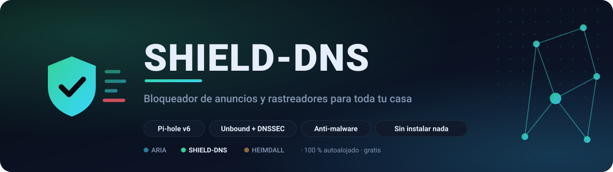
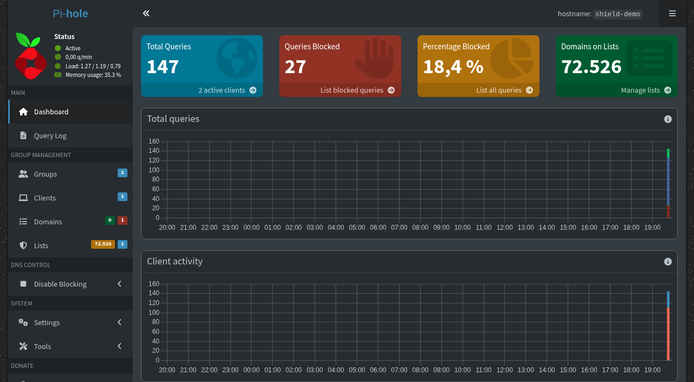
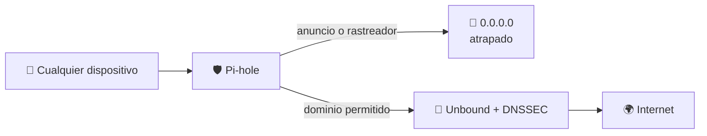
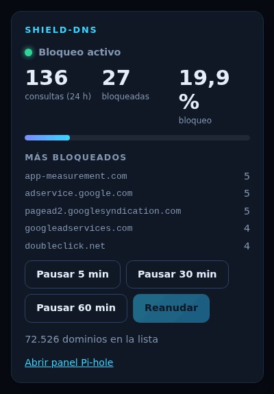
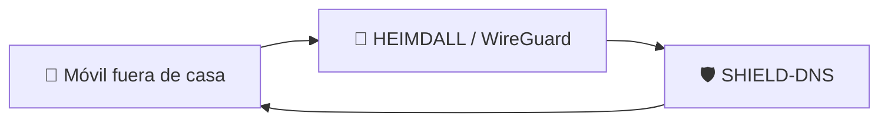

<a name="readme-top"></a>

<p align="center">
  <sub>Parte del ecosistema ARIA&nbsp;&nbsp;·&nbsp;&nbsp;<a href="https://github.com/BertMarti/ARIA">🤖 ARIA</a>&nbsp;&nbsp;·&nbsp;&nbsp;<b>🛡️ SHIELD-DNS</b>&nbsp;&nbsp;·&nbsp;&nbsp;<a href="https://github.com/BertMarti/HEIMDALL">🔐 HEIMDALL</a></sub>
</p>

<p align="center">
  <picture>
    <source media="(prefers-color-scheme: dark)" srcset="docs/img/banner-oscuro.svg">
    <source media="(prefers-color-scheme: light)" srcset="docs/img/banner-claro.svg">
    
  </picture>
</p>

<p align="center">
  <a href="https://bertmarti.github.io/SHIELD-DNS/"></a>
  <a href="https://github.com/BertMarti/SHIELD-DNS/actions/workflows/ci.yml"></a>
  <a href="LICENSE"></a>
  
  
  
  
  
</p>

<p align="center">
  <b><a href="#instalacion">🚀 Instalar</a></b>&nbsp;&nbsp;·&nbsp;&nbsp;
  <a href="#apuntarlo-como-dns">📡 Apuntarlo como DNS</a>&nbsp;&nbsp;·&nbsp;&nbsp;
  <a href="#lo-que-tienes-que-hacer-tu">🙋 Lo que tienes que hacer tú</a>&nbsp;&nbsp;·&nbsp;&nbsp;
  <a href="#con-aria">🤖 Con ARIA</a>&nbsp;&nbsp;·&nbsp;&nbsp;
  <a href="#problemas-frecuentes">🆘 Problemas</a>
</p>

**SHIELD-DNS atrapa anuncios antes de que lleguen a tu casa.** Es un bloqueador de anuncios, rastreadores y dominios maliciosos para toda la red: Pi-hole filtra las consultas y Unbound las resuelve de forma independiente con validación DNSSEC.

<p align="center"><a href="https://bertmarti.github.io/SHIELD-DNS/"><b>🌐 Ver la web de SHIELD-DNS: instalación paso a paso con capturas</b></a></p>

<p align="right"></p>

Instálalo en una Raspberry Pi o en cualquier Linux con Docker. Después apunta el router a `192.168.1.50` y móviles, teles, consolas y ordenadores quedan protegidos sin instalar nada en cada dispositivo.

<p align="center">
  
  <br><sub>Panel de Pi-hole con datos de demostración.</sub>
</p>

> [!NOTE]
> Todos los ejemplos usan una red ficticia `192.168.1.0/24`, una máquina SHIELD-DNS en `192.168.1.50`, Madrid como zona horaria y `tu-dominio.com` como dominio de ejemplo.

## 🧭 En 30 segundos


```mermaid
flowchart LR
    D["📱 Cualquier dispositivo"] --> P["🛡️ Pi-hole"]
    P -->|"anuncio o rastreador"| X["🚫 0.0.0.0<br/>atrapado"]
    P -->|"dominio permitido"| U["🔐 Unbound + DNSSEC"]
    U --> I["🌍 Internet"]
```

1. Instala los dos contenedores.
2. Configura `192.168.1.50` como DNS en el DHCP del router.
3. Comprueba una consulta bloqueada y una normal.
4. Gestiona listas, grupos y estadísticas desde Pi-hole o ARIA.

<p align="left"></p>

<a id="ping"></a>
## 🧚 Ping

Ping es el hada de luz de ARIA; en SHIELD-DNS **atrapa anuncios** antes de que entren en casa. Sus avisos aparecen junto a las partes importantes del manual.

## 📑 Índice

- [🔍 Qué incluye](#que-incluye)
- [🧚 Ping](#ping)
- [📋 Requisitos](#requisitos)
- [🚀 Instalación](#instalacion)
- [🙋 Lo que tienes que hacer tú](#lo-que-tienes-que-hacer-tu)
- [⚙️ Configuración](#configuracion)
- [📡 Apuntarlo como DNS](#apuntarlo-como-dns)
- [🧭 Operación diaria](#operacion-diaria)
- [🤖 Con ARIA](#con-aria)
- [🔐 Con HEIMDALL](#con-heimdall)
- [💾 Copias y actualizaciones](#copias-y-actualizaciones)
- [🆘 Problemas frecuentes](#problemas-frecuentes)
- [🌐 Ecosistema ARIA](#ecosistema-aria)
- [📄 Licencia](#licencia)

<a id="que-incluye"></a>
## 🔍 Qué incluye

| Pieza | Función |
|---|---|
| **Pi-hole v6** | Bloqueo DNS, listas, allowlist, denylist, grupos, clientes, estadísticas y API REST. |
| **Unbound** | Resolvedor local que consulta la jerarquía DNS y valida DNSSEC. Pi-hole le envía las consultas por la red privada Docker. |
| **Listas** | Lista de Pi-hole más HaGeZi Multi y TIF mini, configuradas en `EXTRA_ADLISTS`. |
| **`aria.lan`** | Nombre local que el instalador apunta a la máquina para entrar en ARIA desde casa o la VPN. |

<a id="requisitos"></a>
## 📋 Requisitos

- Raspberry Pi 4/5 con Raspberry Pi OS de 64 bits, o PC/mini-PC con Debian, Ubuntu u otra distribución Linux.
- Docker y el plugin `docker compose v2`. `install.sh` instala Docker si falta.
- Puerto 53 TCP y UDP libre.
- IP fija o reserva DHCP para la máquina. En los ejemplos: `192.168.1.50`.

> [!WARNING]
> Windows, WSL2 y Docker Desktop no son recomendables para exponer DNS a toda la LAN: el puerto 53 y el acceso desde otros dispositivos suelen dar problemas.

<a id="instalacion"></a>
## 🚀 Instalación

<p align="right"></p>

```bash
sudo apt update && sudo apt install -y git openssl
mkdir -p ~/homelab && cd ~/homelab
git clone https://github.com/BertMarti/SHIELD-DNS.git
cd SHIELD-DNS
./install.sh --comprobar
./install.sh
```

`./install.sh --comprobar` solo revisa Docker, Docker Compose v2, la arquitectura compatible (amd64, arm64, armhf o armel) y que estén libres el puerto 53 TCP/UDP y los puertos del panel 8080/8443. No cambia nada: devuelve `0` si todo está listo y `1` si muestra un problema y su arreglo exacto.

La primera vez, si no existe `.env` y estás en una terminal, el instalador hace dos preguntas: la contraseña del panel (Enter genera una segura de 24 caracteres y la muestra una sola vez en el resumen; si eliges una, debe tener al menos 12 caracteres y solo letras, números y `. _ - @ % + = , : ! * ^`) y si quieres añadir las listas recomendadas. La zona horaria se toma del sistema. Si `.env` ya existe no pregunta nada, como en `./update.sh`; sin terminal usa los valores por defecto y no imprime la contraseña.

El instalador es idempotente y hace lo siguiente:

1. Comprueba Docker, Docker Compose v2, la arquitectura y los puertos 53, 8080 y 8443.
2. Crea `.env` con permisos `600` desde el primer momento, genera la contraseña si falta, toma la zona horaria del sistema y establece `aria.lan` con la IP detectada.
3. Arranca `shield-unbound` y `shield-pihole`, y espera el estado saludable de Pi-hole.
4. Registra las listas de `EXTRA_ADLISTS` y solo las descarga si hay alguna nueva.
5. Comprueba que el DNS responde.

Panel: `https://192.168.1.50:8443/admin`. El certificado es autofirmado. La contraseña está en `.env`:

```bash
grep PIHOLE_PASSWORD .env
```

<p align="right"><a href="#readme-top">⬆️ Volver arriba</a></p>

<a id="lo-que-tienes-que-hacer-tu"></a>
## 🙋 Lo que tienes que hacer tú

- **Tras esta actualización (fase 2):** ejecuta `./update.sh` en un momento tranquilo. No descarga imágenes nuevas, pero recrea los contenedores una vez y la casa se queda sin DNS unos segundos. Después comprueba que todo está en marcha con `docker compose ps` y que bloquea con `nslookup doubleclick.net 192.168.1.50` (pon la IP de tu Raspberry): debe responder `0.0.0.0`.
- Cambia el DNS del router a la IP de la máquina, siguiendo los pasos de [Apuntarlo como DNS](#apuntarlo-como-dns).
- Reserva una IP fija para la máquina, por ejemplo `192.168.1.50`.
- Guarda la contraseña del panel cuando el instalador la muestre; la contraseña generada solo se enseña una vez.
- En enero, revisa manualmente la versión 2027 de Pi-hole: Dependabot no propone esa actualización mayor.
- (Avanzado) Decide si activar los límites de memoria: en Raspberry Pi OS viene desactivado (`cgroup_disable=memory`) y hay que añadir `cgroup_enable=memory` al final de la única línea de `/boot/firmware/cmdline.txt` y reiniciar.

<p align="right"><a href="#readme-top">⬆️ Volver arriba</a></p>

<a id="configuracion"></a>
## ⚙️ Configuración

Todo se guarda en `.env` (lo crea y rellena `install.sh`). Si cambias algo, vuelve a ejecutar `./install.sh`.
Las listas, los dominios permitidos o bloqueados, los clientes y los grupos se administran desde el panel de Pi-hole.
La tabla de variables y los nombres locales extra (como `nas.lan`) están en la [guía técnica](docs/DESARROLLO.md#configuracion).

<a id="apuntarlo-como-dns"></a>
## 📡 Apuntarlo como DNS

### Router, opción recomendada

1. Abre el router, normalmente `http://192.168.1.1`.
2. Busca **LAN**, **DHCP** o **DNS**.
3. Pon `192.168.1.50` como DNS primario.
4. Deja vacío el secundario o repite `192.168.1.50`. Un DNS externo permite saltarse el bloqueo.
5. Guarda y renueva el Wi-Fi o el DHCP de los dispositivos.

Si el router no deja cambiar el DNS, ponlo a mano en cada dispositivo (tabla de abajo). El DHCP de Pi-hole **no funciona con esta instalación**: Pi-hole está en una red Docker en modo puente y no recibe las peticiones DHCP de la casa.

> [!WARNING]
> No abras el puerto 53 ni el panel (8080/8443) en el router. El DNS solo debe responder dentro de casa y, si usas HEIMDALL, desde la VPN.

### Un dispositivo concreto

| Dispositivo | Ajuste |
|---|---|
| Android | Wi-Fi → tu red → IP estática → DNS 1: `192.168.1.50`. Desactiva **DNS privado**. |
| iPhone/iPad | Wi-Fi → (i) → Configurar DNS → Manual → `192.168.1.50`. |
| Windows, macOS o Linux | Configuración de red → DNS manual: `192.168.1.50`. |

> [!IMPORTANT]
> Si el router anuncia un DNS IPv6 del operador, algunos equipos lo usarán y evitarán SHIELD-DNS. Configura el DNS IPv6 o desactívalo en la LAN.

Comprueba desde un equipo de la red `192.168.1.0/24`:

```bash
nslookup doubleclick.net 192.168.1.50  # debe devolver 0.0.0.0
nslookup example.com 192.168.1.50      # debe devolver una IP normal
```

<p align="right"><a href="#readme-top">⬆️ Volver arriba</a></p>

<a id="operacion-diaria"></a>
## 🧭 Operación diaria

| Necesidad | Acción en el panel |
|---|---|
| Ver consultas y bloqueos | **Dashboard** o **Query Log**. |
| Permitir un dominio | **Query Log** → el dominio bloqueado → permitir (o **Domains** → *Allow*). |
| Bloquear un dominio | **Domains** → *Deny*. |
| Actualizar listas ahora | **Tools** → **Update Gravity**. |
| Pausar el bloqueo | **Disable blocking**: indefinidamente, 10 s, 30 s, 5 min o un tiempo personalizado. |

Las mismas tareas desde la terminal (y los registros) están en la [guía técnica](docs/DESARROLLO.md).

El bloqueo DNS no puede distinguir un anuncio que comparte dominio con el contenido, como algunos anuncios de vídeo. Si una app se rompe, busca el dominio en **Query Log** y añádelo a la allowlist solo si confías en él.

<a id="con-aria"></a>
## 🤖 Con ARIA

<p align="left"></p>

ARIA se conecta a la API de Pi-hole y convierte SHIELD-DNS en una pieza operable desde el panel y el chat. Si ambos proyectos están en `~/homelab/SHIELD-DNS` y `~/homelab/ARIA`, su instalador detecta la contraseña de Pi-hole. Si no, configura en el `.env` de ARIA:

```bash
SHIELD_URL=http://192.168.1.50:8080
SHIELD_PASSWORD=la-contraseña-de-pihole
```

ARIA ofrece:

- Estadísticas de consultas y bloqueos en el Centro de control.
- Pausar el bloqueo 5, 30 o 60 minutos, y reanudarlo.
- Preguntas en el chat como «¿cuántos anuncios has bloqueado hoy?» y `/bloqueo` en Telegram.
- Resumen diario con bloqueos y aviso si SHIELD-DNS deja de responder.
- Informe semanal por Telegram.
- Listas: ver el número de dominios y lanzar una actualización de gravity.
- Control parental por dispositivo: por ejemplo, pausar el dispositivo de Ana, bloquear servicios y aplicar horarios.
- Grupos propios de Pi-hole como `ARIA-pausa` y `ARIA-svc-...`, sin tocar grupos ajenos.
- Control opcional de nombres conocidos de DNS cifrado por dispositivo para evitar saltos sencillos al filtro.

El control parental es bloqueo DNS: no puede impedir DNS fijado manualmente, todo DNS cifrado ni una VPN. Para una dirección pública usa, por ejemplo, `https://shield.tu-dominio.com` a través de la configuración de ARIA/HEIMDALL.

<p align="center">
  
  <br><sub>Tarjeta de SHIELD-DNS en ARIA con datos de demostración.</sub>
</p>

<p align="right"><a href="#readme-top">⬆️ Volver arriba</a></p>

<a id="con-heimdall"></a>
## 🔐 Con HEIMDALL

Si instalas SHIELD-DNS antes que HEIMDALL, la VPN lo usa como DNS automáticamente. Así el móvil sigue filtrando anuncios fuera de casa. Si instalaste HEIMDALL primero, configura `192.168.1.50` como DNS en su panel de administración.


```mermaid
flowchart LR
    M["📱 Móvil fuera de casa"] --> H["🔐 HEIMDALL / WireGuard"]
    H --> S["🛡️ SHIELD-DNS"]
    S --> M
```

<a id="copias-y-actualizaciones"></a>
## 💾 Copias y actualizaciones

### Copia

```bash
./backup.sh
```

Crea `backups/shield-dns-AAAAMMDD-HHMM.tar.gz` con `.env` y una exportación Teleporter de Pi-hole: listas, allowlist, denylist, clientes, grupos y ajustes. Conserva las siete más recientes y protege el archivo con permisos `600`. Contiene la contraseña: guárdalo fuera de la máquina.

### Restauración

```bash
mkdir -p backups
cp /ruta/a/shield-dns-AAAAMMDD-HHMM.tar.gz backups/
./restore.sh backups/shield-dns-AAAAMMDD-HHMM.tar.gz
```

El script pide confirmación, restaura `.env`, instala y carga de nuevo la configuración de Pi-hole.

### Actualización

```bash
./update.sh
```

Hace una copia, ejecuta `git pull --ff-only`, descarga imágenes nuevas y vuelve a instalar. Los datos de `data/pihole/` se conservan.

<p align="right"><a href="#readme-top">⬆️ Volver arriba</a></p>

<a id="problemas-frecuentes"></a>
## 🆘 Problemas frecuentes

<p align="right"></p>

<details>
<summary><b>El puerto 53 está ocupado</b></summary>

Si lo ocupa `systemd-resolved` en `127.0.0.53` o `127.0.0.54`, aplica este arreglo exacto:

```bash
sudo mkdir -p /etc/systemd/resolved.conf.d
printf '[Resolve]\nDNSStubListener=no\n' | sudo tee /etc/systemd/resolved.conf.d/shield-dns.conf
sudo ln -sf /run/systemd/resolve/resolv.conf /etc/resolv.conf
sudo systemctl restart systemd-resolved
./install.sh --comprobar
```

Si es otro servicio, localízalo con `sudo ss -tulpn | grep ':53 '`. Los habituales se paran con `sudo systemctl disable --now dnsmasq`, `sudo systemctl disable --now pihole-FTL` o `sudo systemctl disable --now named`. Si ya es SHIELD-DNS quien usa el puerto, no es un problema.
</details>

<details>
<summary><b>La casa se queda sin internet</b></summary>

Comprueba `docker compose ps` y `docker compose logs pihole`. Mientras lo solucionas, devuelve temporalmente al router el DNS anterior. Tras desinstalar, ejecuta también `./uninstall.sh` y recuerda cambiar el DNS del router.
</details>

<details>
<summary><b>No se bloquean anuncios</b></summary>

Comprueba que el dispositivo recibe `192.168.1.50`, desactiva **DNS privado**, revisa IPv6 y confirma en **Query Log** que llegan consultas. YouTube y otros servicios pueden mezclar anuncio y contenido en el mismo dominio.
</details>

<details>
<summary><b>Una web o aplicación deja de funcionar</b></summary>

Busca la consulta bloqueada en **Query Log** y permítela desde el panel o con `docker exec shield-pihole pihole allow dominio.com`.
</details>

<details>
<summary><b>El panel no carga u olvidé la contraseña</b></summary>

Usa `https://192.168.1.50:8443/admin`, con `/admin`, y revisa `docker compose logs pihole`. La contraseña está en `.env`: `grep PIHOLE_PASSWORD .env`.
</details>

<details>
<summary><b>DNSSEC falla</b></summary>

Unbound es quien valida DNSSEC; Pi-hole lo deja desactivado para no validarlo dos veces. Comprueba el resolvedor con `docker compose logs unbound` y el estado con `docker compose ps`.
</details>

<p align="right"><a href="#readme-top">⬆️ Volver arriba</a></p>

<a id="ecosistema-aria"></a>
## 🌐 Ecosistema ARIA

| Proyecto | Función | Puertos |
|---|---|---|
| [ARIA](https://github.com/BertMarti/ARIA) | Asistente y panel central de la casa. | 80, 443 |
| **SHIELD-DNS** | Bloqueador DNS con Pi-hole y Unbound. | 53, 8080, 8443 |
| [HEIMDALL](https://github.com/BertMarti/HEIMDALL) | VPN WireGuard para entrar en casa desde fuera. | 51820/udp, 51843 |

<a id="licencia"></a>
## 📄 Licencia

MIT. Consulta [LICENSE](LICENSE).

🛠️ ¿Quieres modificar SHIELD-DNS? Mira la [guía técnica](docs/DESARROLLO.md). Para avisar de un fallo de seguridad: [SECURITY.md](SECURITY.md).

<p align="right"><br><a href="#readme-top">⬆️ Volver arriba</a></p>
